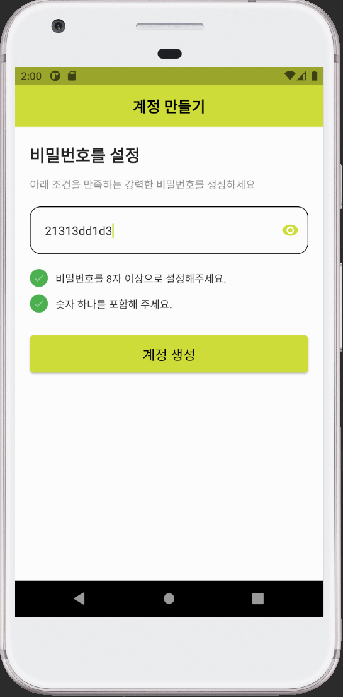

# memorized_CreateAccount
첫번째 패스워드 유효성 검사 페이지 더듬더듬 타이핑
두번째 패스워드 유효성 검사 페이지 더듬더듬 타이핑

## 결과물 첫번째
 
## 결과물 첫번째
 

## 유튜브
[Flutter Password Validation with Visibility - Day 29](https://www.youtube.com/watch?v=Uahlo90ER18&feature=youtu.be)

## 배운 것들

* 위젯: AnimatedContainer, MaterialButton, TextField, OutlineInputBorder, InputDecoration
* 패키지:

## Snippet
