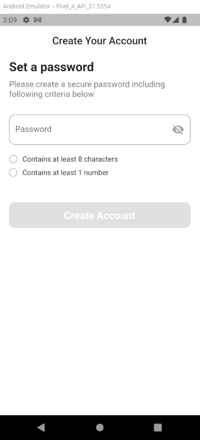

# 패스워드 생성 화면

패스워드 유효성 점검 페이지

## 결과물

 


## Youtube

[Flutter Password Validation with Visibility - Day 29](https://www.youtube.com/watch?v=Uahlo90ER18)


## Lesson learned

* AnimatedContainer
* 정규식 `RegExp`
* 패스워드 유효성 점검 결과를 별도 위젯으로 분리


## Sinppets

* 조건에 따른 버튼의 활성화/비활성화
```dart
ElevatedButton(
  onPressed: (_isPasswordHas8Length && _isPasswordHasOneNumber) ? (){} : null,
```

