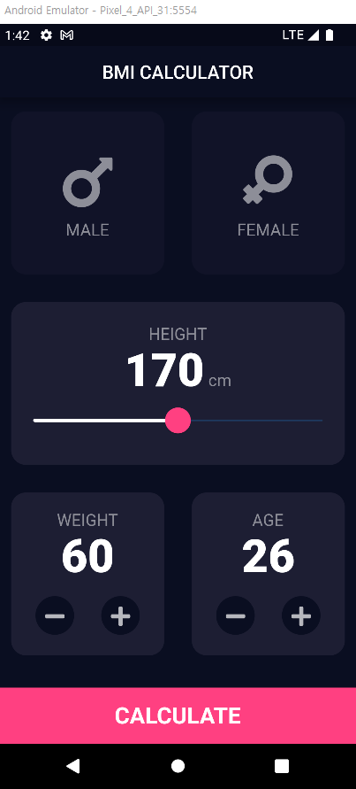

# BMI 계산기

2개의 페이지로 구성된 BMI 계산기

## 결과물

 


## Design resource

[Simple BMI Calculator from dribbble](https://dribbble.com/shots/4585382-Simple-BMI-Calculator)

## Lesson learned

* RawMaterialButton
* routes, initialRoute, Navigator.pushNamed
* Package: Fluttertoast
* Package: FontAwesome

## Sinppets

named route를 사용할 때 인자 전달

```dart
// 호출 쪽
Navigator.pushNamed(context, '/result', arguments: UserInfo(height: height, weight: weight));

// 받는 쪽
userInfo = ModalRoute.of(context)!.settings.arguments as UserInfo;
```


