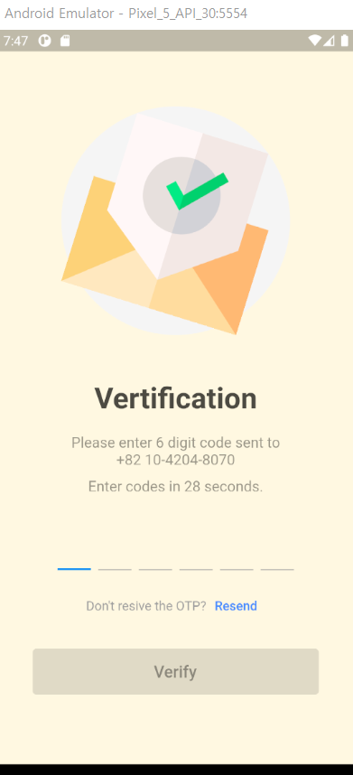

# OTP 검증화면

시간제한이 있는 OTP 검증 화면

## 결과물

 

## Youtube

[Flutter OTP Validation Page UI Design - Day 30](https://www.youtube.com/watch?v=ezomu3iMCCI)

## Lesson learned

* FocusNode: TextField의 forcus를 부여하기도 회수하기도 함

* TextField는 SizeBox(width:0, height:0)으로 감싸서 숨기고 입력된 값을 List.generate에 Container에 넣어서 표시

* Timer를 재생성하기 전에는 무조건 .cancel부터 해야 중복 실행되는걸 방지할 수 있음

* Fluttertoast

* showDialog, AlertDialog

* Transform.rotate

* Visibility

* Future.delayed

## Sinppets

