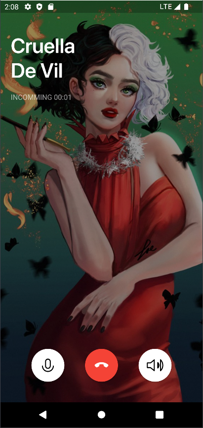

# Calling screen

### Preview

 

### 강좌: https://www.youtube.com/watch?v=N5Cqyq3z5Jk

### 아쉬운 점

* 버튼을 ElevatedButton으로 구현했는데 색상을 흰색으로 바꾸면 기본 Spash 색상이랑 같아져서 버튼 누름 효과가 나타나지 않음
* SizeConfig 클래스까지는 만들었으나 비율 크기를 적용하지는 않음

