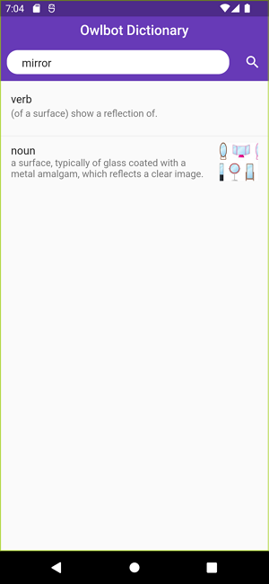

# Owlbot Dictionary

RxVMS 패턴에 맞춰 개발한 예제

## Preview

 

## RxVMS 패턴

* Rx: 반응형을 의미
* V: View. `lib/screens` 폴더에 view와 관련된 코드 위치
* M: Manager. `lib/managers` 폴더에 Stream 형태로 데이터를 공급하기 위한 매니저 코드 위치
* S: Service. `lib/services` 폴더에 외부 자원을 조회하여 공급하기 위한 서비스 코드 위치

## 유튜브 링크

https://youtu.be/ZjFzDZ4KV-s

