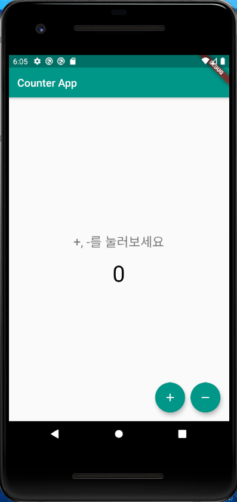
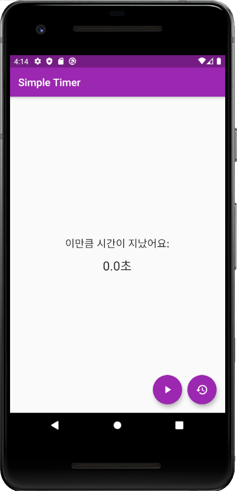
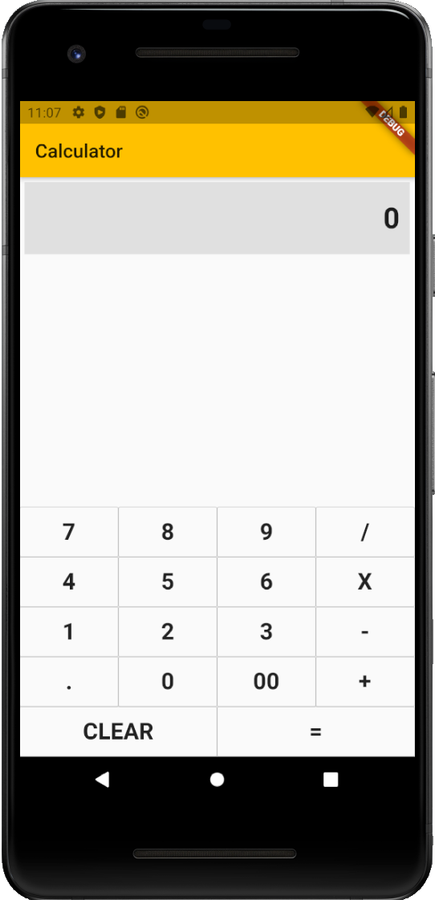

# Excercies

학습용 프로젝트 저장 공간

## counter_app

단순한 숫자 증감 앱.

### 주요 기능

* +, - 버튼이 나타나고 터치할 때 마다 1을 더하거나 뺀다.
* 마이너스인 경우 숫자를 빨간색으로 표시한다.

### 학습한 내용

* runApp, MaterialApp, Scaffold, StatelessWidget, StatefulWidget 
* 레이아웃의 완전 기초: Center, Column, Row
* FloatingActionButton
* 사용자 함수, SetState 등
* 단순한 텍스트 스타일링

## stream_builder

StreamBuilder를 이용한 타이머 앱

### 학습한 내용

* StreamBuilder의 사용법
* Stopwatch 클래스
* Timer, Duration 클래스

### Screen

## Calculator

학습한 내용: Row, Calc, Expanded, OutlineButton, function parameter

### screenshot

